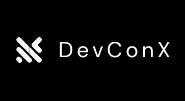
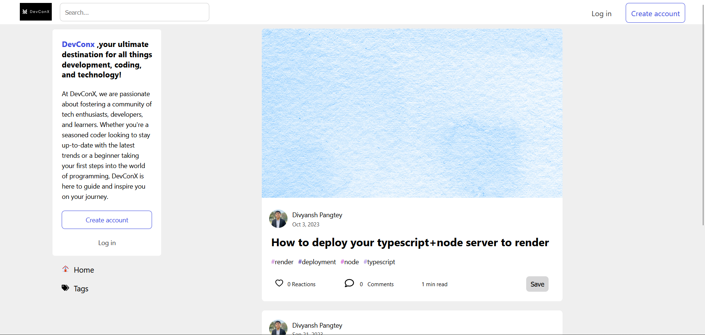
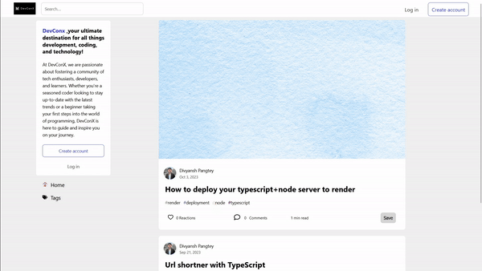
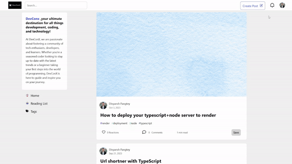
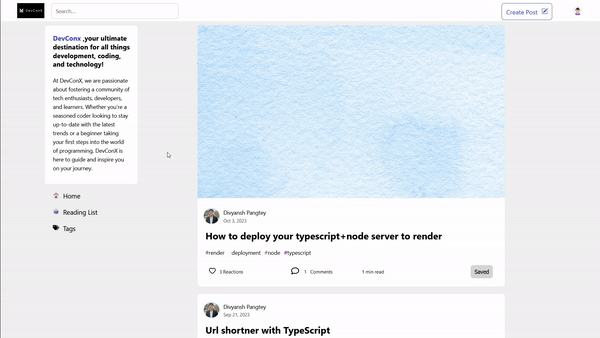

<h1 align="center">
  <br>
  <a href="https://devconx.netlify.app/"></a>
  <br>
  <br>
  <b>DevConX</b>
  <br>
</h1>

> A multi user blog website build with React,Node,Express,MongoDB with AI based suggestions using OpenAI API



## [Live Site](https://devconx.netlify.app/)

## Backend Code available at : https://github.com/Divyansh-P/Devconxserver 

## Features

- Login / Signup
- Create / Remove / Update / Delete Post
- Like / Fire / Bookmark Post
- Reading List
- Create / Add Tags to Post
- Follow Tags
- Find Posts by Tags
- Comment / Replies
- Like Comment
- Edit / Delete Comment
- View Profile
- Edit Profile
- Follow User
- Search Posts
- Skeleton Loading


# How to setup locally

* Clone repo to your local machine `git clone https://github.com/Divyansh-P/DevConXclient.git`
* Install dependencies ```npm i```
* Set up the backend server from https://github.com/Divyansh-P/Devconxserver 
Set up the following environment variables in .env file <br>
```js
REACT_APP_BASE_URL=https://localhost:5000/api
REACT_APP_SOCKET_IO_URL=https://localhost:5000/
```

Finally, run <code>npm start</code>

```shell
$ npm start

```
## Screenshots

### Login / Signup



### Create New Post / Edit Post /Delete Post



### Like and Comment and bookmark


### Follow Tags 



 


